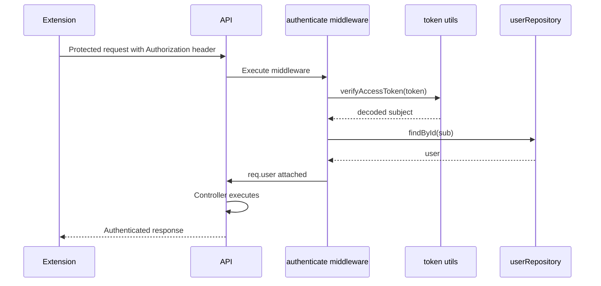

# Extension Authentication Sequence

The extension uses the same bearer-token model as the frontend for protected backend APIs.

The current LeetCode extension upload endpoint uses this flow. Observability SDK events are not uploaded to the backend yet.
