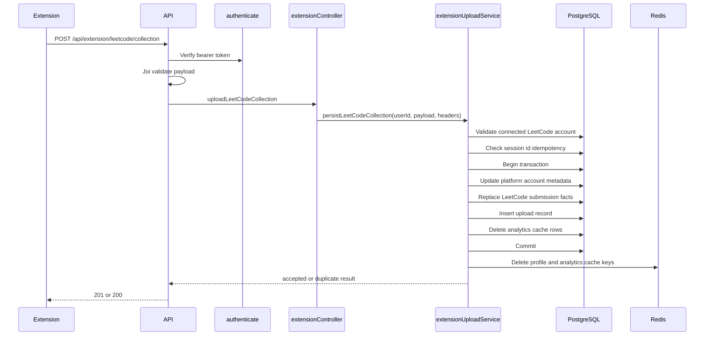

# Extension Upload Sequence

This sequence documents implemented LeetCode extension upload behavior.

```mermaid
sequenceDiagram
  participant Extension
  participant API
  participant Auth as authenticate
  participant Controller as extensionController
  participant Service as extensionUploadService
  participant DB as PostgreSQL
  participant Redis

  Extension->>API: POST /api/extension/leetcode/collection
  API->>Auth: Verify bearer token
  API->>API: Joi validate payload
  API->>Controller: uploadLeetCodeCollection
  Controller->>Service: persistLeetCodeCollection(userId, payload, headers)
  Service->>DB: Validate connected LeetCode account
  Service->>DB: Check session id idempotency
  Service->>DB: Begin transaction
  Service->>DB: Update platform account metadata
  Service->>DB: Replace LeetCode submission facts
  Service->>DB: Insert upload record
  Service->>DB: Delete analytics cache rows
  Service->>DB: Commit
  Service->>Redis: Delete profile and analytics cache keys
  Service-->>API: accepted or duplicate result
  API-->>Extension: 201 or 200
```
