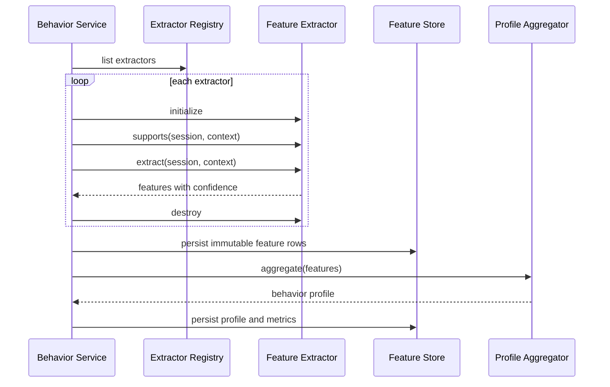

# Feature Extraction Sequence

```mermaid
sequenceDiagram
  participant Service as Behavior Service
  participant Registry as Extractor Registry
  participant Extractor as Feature Extractor
  participant Store as Feature Store
  participant Profile as Profile Aggregator

  Service->>Registry: list extractors
  loop each extractor
    Service->>Extractor: initialize
    Service->>Extractor: supports(session, context)
    Service->>Extractor: extract(session, context)
    Extractor-->>Service: features with confidence
    Service->>Extractor: destroy
  end
  Service->>Store: persist immutable feature rows
  Service->>Profile: aggregate(features)
  Profile-->>Service: behavior profile
  Service->>Store: persist profile and metrics
```
