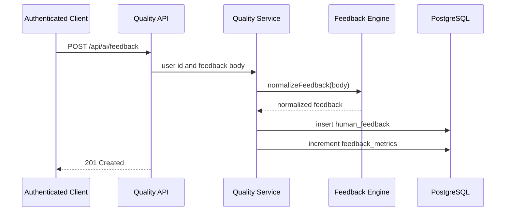

# Feedback Processing Sequence

```mermaid
sequenceDiagram
  participant Client as Authenticated Client
  participant API as Quality API
  participant Service as Quality Service
  participant Engine as Feedback Engine
  participant DB as PostgreSQL

  Client->>API: POST /api/ai/feedback
  API->>Service: user id and feedback body
  Service->>Engine: normalizeFeedback(body)
  Engine-->>Service: normalized feedback
  Service->>DB: insert human_feedback
  Service->>DB: increment feedback_metrics
  API-->>Client: 201 Created
```
