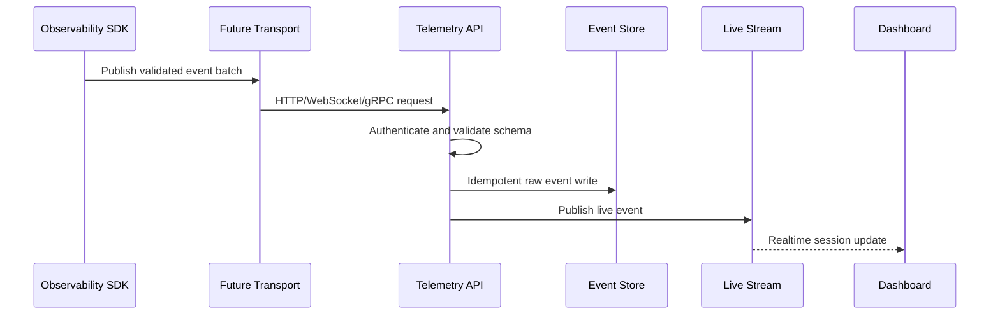

# Future Live Telemetry Sequence

This sequence is planned architecture, not current implementation.

```mermaid
sequenceDiagram
  participant SDK as Observability SDK
  participant Transport as Future Transport
  participant API as Telemetry API
  participant Store as Event Store
  participant Stream as Live Stream
  participant Dashboard

  SDK->>Transport: Publish validated event batch
  Transport->>API: HTTP/WebSocket/gRPC request
  API->>API: Authenticate and validate schema
  API->>Store: Idempotent raw event write
  API->>Stream: Publish live event
  Stream-->>Dashboard: Realtime session update
```

Future live telemetry should preserve raw event writes before derived analytics.
