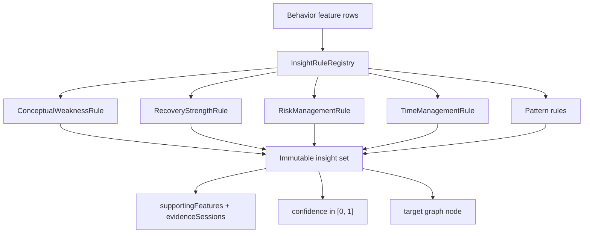
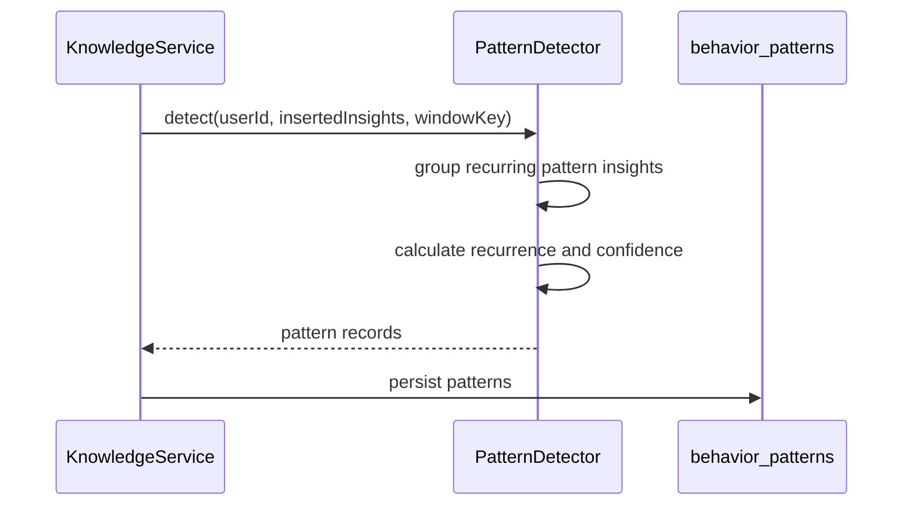

# Insight Generation Sequence

Insight generation is rule-based and plugin-oriented. Rules translate numeric feature evidence into semantic insights.

## Rule Examples

| Input Evidence | Emitted Insight |
| --- | --- |
| High reading time and low confidence indicator | `conceptual_weakness` |
| High persistence and high recovery rate | `strong_recovery_ability` |
| High risk appetite and late contest panic | `risk_management_weakness` |
| High attention stability and low late panic | `strong_time_management` |
| Repeated late panic observations | `repeated_late_panic` |
| Repeated difficulty avoidance observations | `difficulty_avoidance` |
| Fast problem scanning and high confidence indicator | `fast_recognition` |

## Pattern Detection

Pattern rows include `pattern_key`, `pattern_type`, confidence, recurrence count, first and last seen timestamps, supporting insight IDs, evidence JSON, and version.

