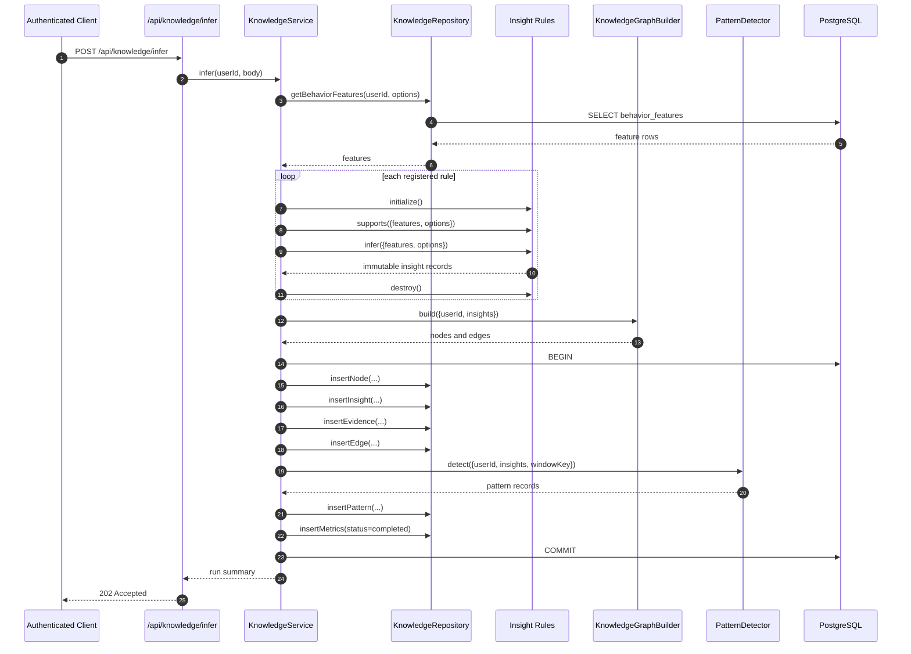
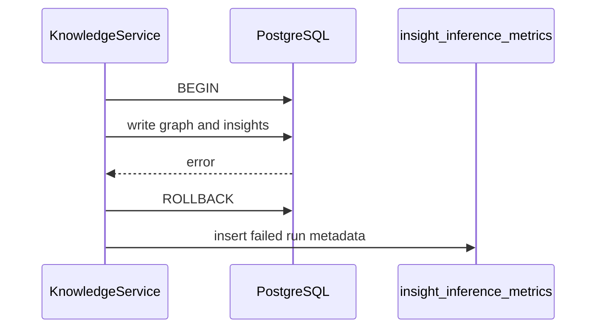

# Knowledge Inference Sequence

This sequence shows how existing behavior features become persisted knowledge graph rows.

## Failure Path

No partial graph write should survive a failed transaction.

