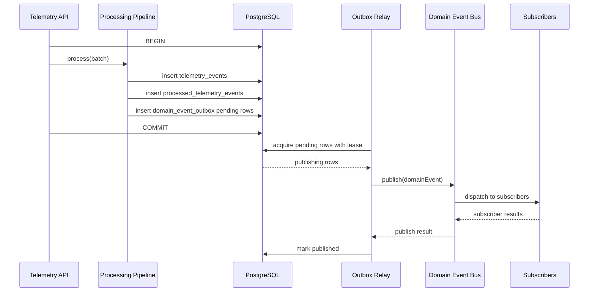

# Outbox Relay Sequence

This sequence shows the reliable event publication path introduced by the Transactional Outbox.

```mermaid
sequenceDiagram
  participant API as Telemetry API
  participant P as Processing Pipeline
  participant DB as PostgreSQL
  participant R as Outbox Relay
  participant B as Domain Event Bus
  participant S as Subscribers

  API->>DB: BEGIN
  API->>P: process(batch)
  P->>DB: insert telemetry_events
  P->>DB: insert processed_telemetry_events
  P->>DB: insert domain_event_outbox pending rows
  API->>DB: COMMIT
  R->>DB: acquire pending rows with lease
  DB-->>R: publishing rows
  R->>B: publish(domainEvent)
  B->>S: dispatch to subscribers
  S-->>B: subscriber results
  B-->>R: publish result
  R->>DB: mark published
```

No domain event is published before the database transaction commits.
