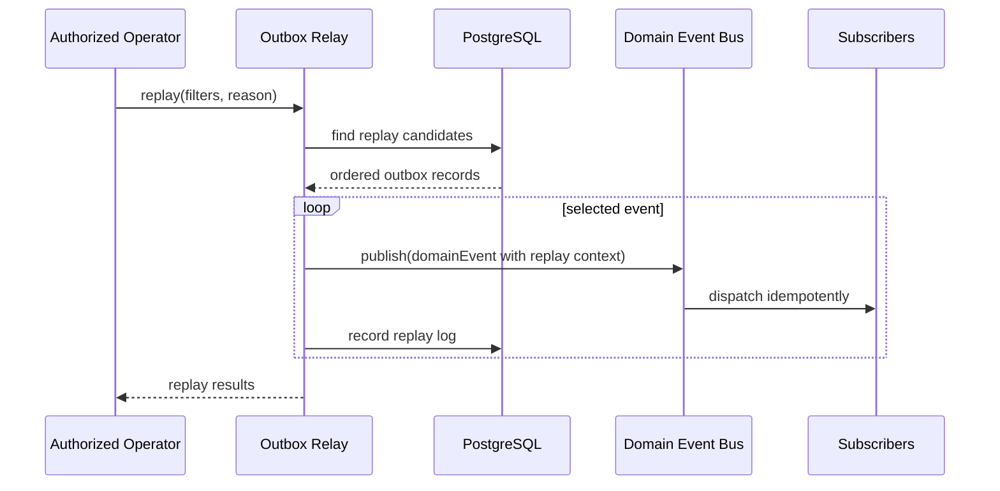

# Outbox Replay Sequence

Replay republishes selected published or dead-letter outbox events through the same Domain Event Bus contract.

Replay must be treated as an administrative operation. Future public replay endpoints must require explicit authorization.
