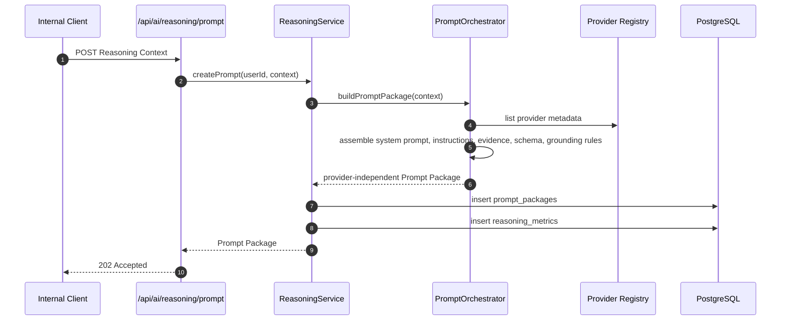

# Prompt Generation

```mermaid
sequenceDiagram
  autonumber
  participant Client as Internal Client
  participant API as /api/ai/reasoning/prompt
  participant Service as ReasoningService
  participant Orchestrator as PromptOrchestrator
  participant Providers as Provider Registry
  participant DB as PostgreSQL

  Client->>API: POST Reasoning Context
  API->>Service: createPrompt(userId, context)
  Service->>Orchestrator: buildPromptPackage(context)
  Orchestrator->>Providers: list provider metadata
  Orchestrator->>Orchestrator: assemble system prompt, instructions, evidence, schema, grounding rules
  Orchestrator-->>Service: provider-independent Prompt Package
  Service->>DB: insert prompt_packages
  Service->>DB: insert reasoning_metrics
  Service-->>API: Prompt Package
  API-->>Client: 202 Accepted
```

The Prompt Package is ready for future provider adapters but is not sent to any provider in Phase 3.4C.

