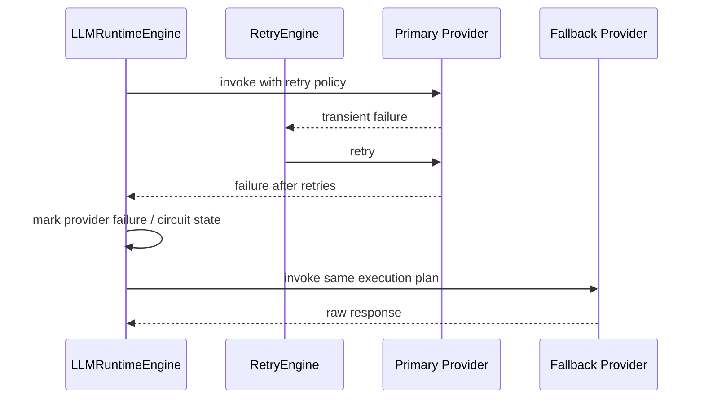

# Provider Failover

```mermaid
sequenceDiagram
  participant Runtime as LLMRuntimeEngine
  participant Retry as RetryEngine
  participant Primary as Primary Provider
  participant Fallback as Fallback Provider

  Runtime->>Primary: invoke with retry policy
  Primary-->>Retry: transient failure
  Retry->>Primary: retry
  Primary-->>Runtime: failure after retries
  Runtime->>Runtime: mark provider failure / circuit state
  Runtime->>Fallback: invoke same execution plan
  Fallback-->>Runtime: raw response
```

The AI Execution Plan remains unchanged during provider failover.

