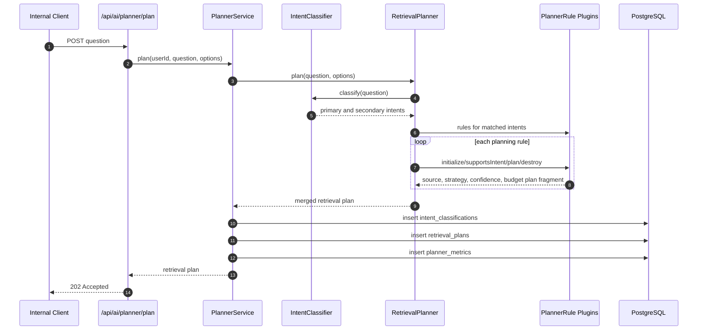

# Question Planning Sequence

```mermaid
sequenceDiagram
  autonumber
  participant Client as Internal Client
  participant API as /api/ai/planner/plan
  participant Service as PlannerService
  participant Classifier as IntentClassifier
  participant Planner as RetrievalPlanner
  participant Rules as PlannerRule Plugins
  participant DB as PostgreSQL

  Client->>API: POST question
  API->>Service: plan(userId, question, options)
  Service->>Planner: plan(question, options)
  Planner->>Classifier: classify(question)
  Classifier-->>Planner: primary and secondary intents
  Planner->>Rules: rules for matched intents
  loop each planning rule
    Planner->>Rules: initialize/supportsIntent/plan/destroy
    Rules-->>Planner: source, strategy, confidence, budget plan fragment
  end
  Planner-->>Service: merged retrieval plan
  Service->>DB: insert intent_classifications
  Service->>DB: insert retrieval_plans
  Service->>DB: insert planner_metrics
  Service-->>API: retrieval plan
  API-->>Client: 202 Accepted
```

The plan is execution metadata only. No retrieval or LLM invocation occurs in this sequence.

