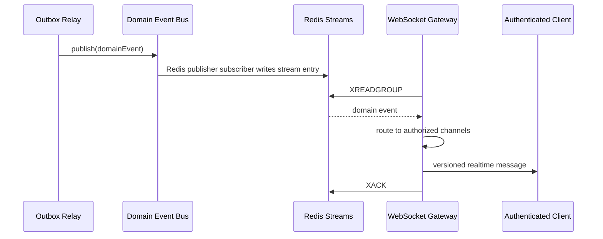

# Realtime Event Flow

```mermaid
sequenceDiagram
  participant O as Outbox Relay
  participant B as Domain Event Bus
  participant R as Redis Streams
  participant G as WebSocket Gateway
  participant C as Authenticated Client

  O->>B: publish(domainEvent)
  B->>R: Redis publisher subscriber writes stream entry
  G->>R: XREADGROUP
  R-->>G: domain event
  G->>G: route to authorized channels
  G->>C: versioned realtime message
  G->>R: XACK
```

The gateway performs routing and serialization only. It does not read telemetry storage or the outbox.
