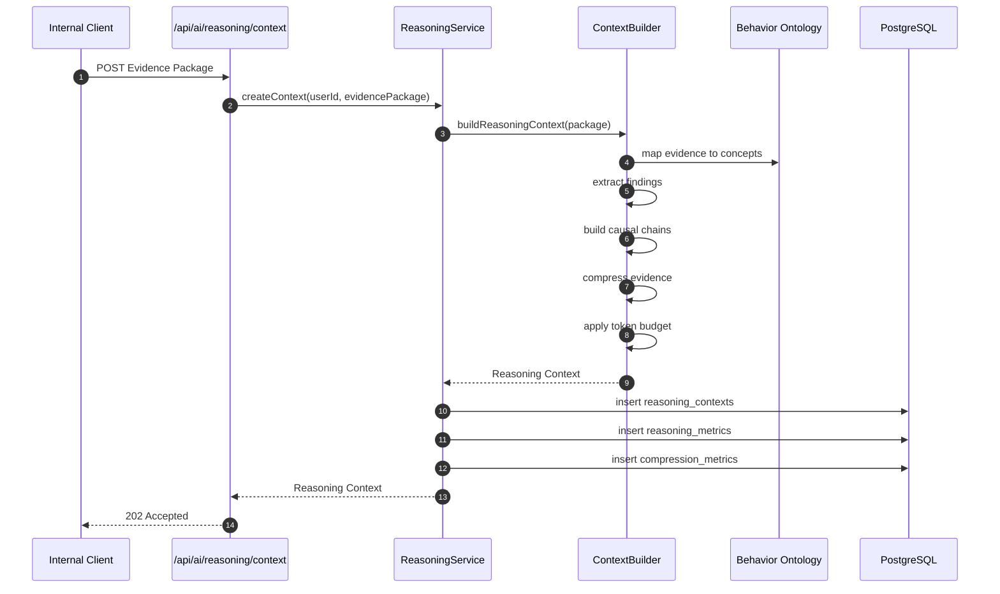

# Reasoning Pipeline

```mermaid
sequenceDiagram
  autonumber
  participant Client as Internal Client
  participant API as /api/ai/reasoning/context
  participant Service as ReasoningService
  participant Engine as ContextBuilder
  participant Ontology as Behavior Ontology
  participant DB as PostgreSQL

  Client->>API: POST Evidence Package
  API->>Service: createContext(userId, evidencePackage)
  Service->>Engine: buildReasoningContext(package)
  Engine->>Ontology: map evidence to concepts
  Engine->>Engine: extract findings
  Engine->>Engine: build causal chains
  Engine->>Engine: compress evidence
  Engine->>Engine: apply token budget
  Engine-->>Service: Reasoning Context
  Service->>DB: insert reasoning_contexts
  Service->>DB: insert reasoning_metrics
  Service->>DB: insert compression_metrics
  Service-->>API: Reasoning Context
  API-->>Client: 202 Accepted
```

No LLM call occurs in this sequence.

