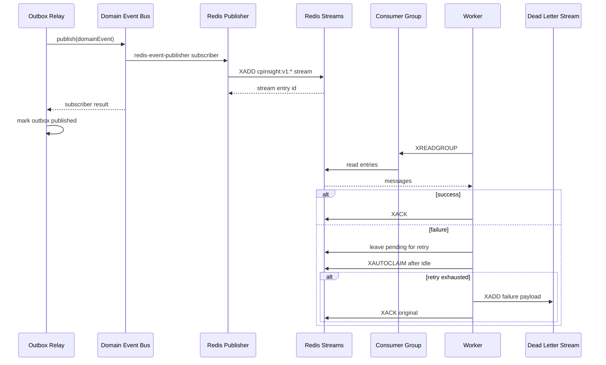

# Redis Event Distribution Sequence

```mermaid
sequenceDiagram
  participant R as Outbox Relay
  participant B as Domain Event Bus
  participant P as Redis Publisher
  participant RS as Redis Streams
  participant C as Consumer Group
  participant W as Worker
  participant DL as Dead Letter Stream

  R->>B: publish(domainEvent)
  B->>P: redis-event-publisher subscriber
  P->>RS: XADD cpinsight:v1:* stream
  RS-->>P: stream entry id
  B-->>R: subscriber result
  R->>R: mark outbox published
  W->>C: XREADGROUP
  C->>RS: read entries
  RS-->>W: messages
  alt success
    W->>RS: XACK
  else failure
    W->>RS: leave pending for retry
    W->>RS: XAUTOCLAIM after idle
    alt retry exhausted
      W->>DL: XADD failure payload
      W->>RS: XACK original
    end
  end
```

The outbox remains the source of reliable publication. Redis is the distributed delivery transport for downstream consumers.
