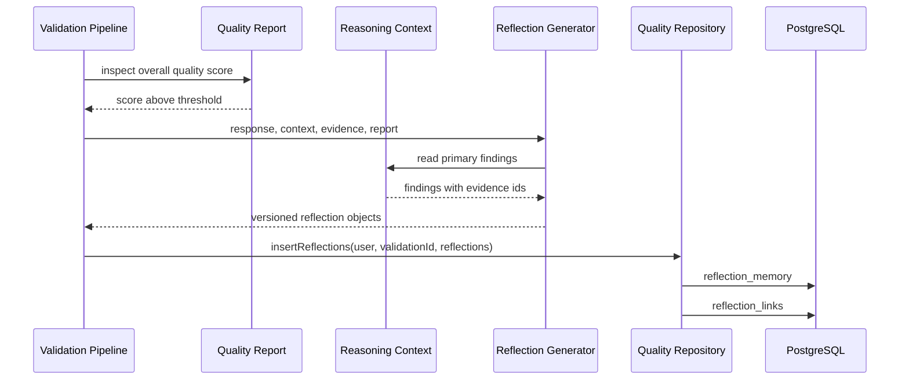

# Reflection Generation Sequence

```mermaid
sequenceDiagram
  participant Pipeline as Validation Pipeline
  participant Quality as Quality Report
  participant Context as Reasoning Context
  participant Generator as Reflection Generator
  participant Repo as Quality Repository
  participant DB as PostgreSQL

  Pipeline->>Quality: inspect overall quality score
  Quality-->>Pipeline: score above threshold
  Pipeline->>Generator: response, context, evidence, report
  Generator->>Context: read primary findings
  Context-->>Generator: findings with evidence ids
  Generator-->>Pipeline: versioned reflection objects
  Pipeline->>Repo: insertReflections(user, validationId, reflections)
  Repo->>DB: reflection_memory
  Repo->>DB: reflection_links
```
