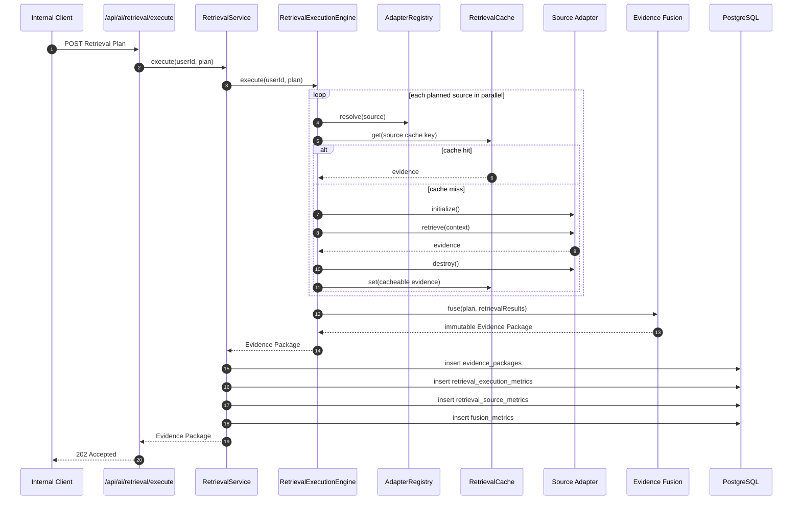

# Retrieval Execution Sequence

```mermaid
sequenceDiagram
  autonumber
  participant Client as Internal Client
  participant API as /api/ai/retrieval/execute
  participant Service as RetrievalService
  participant Engine as RetrievalExecutionEngine
  participant Registry as AdapterRegistry
  participant Cache as RetrievalCache
  participant Adapter as Source Adapter
  participant Fusion as Evidence Fusion
  participant DB as PostgreSQL

  Client->>API: POST Retrieval Plan
  API->>Service: execute(userId, plan)
  Service->>Engine: execute(userId, plan)
  loop each planned source in parallel
    Engine->>Registry: resolve(source)
    Engine->>Cache: get(source cache key)
    alt cache hit
      Cache-->>Engine: evidence
    else cache miss
      Engine->>Adapter: initialize()
      Engine->>Adapter: retrieve(context)
      Adapter-->>Engine: evidence
      Engine->>Adapter: destroy()
      Engine->>Cache: set(cacheable evidence)
    end
  end
  Engine->>Fusion: fuse(plan, retrievalResults)
  Fusion-->>Engine: immutable Evidence Package
  Engine-->>Service: Evidence Package
  Service->>DB: insert evidence_packages
  Service->>DB: insert retrieval_execution_metrics
  Service->>DB: insert retrieval_source_metrics
  Service->>DB: insert fusion_metrics
  Service-->>API: Evidence Package
  API-->>Client: 202 Accepted
```

Partial source failures are recorded in the package and metrics. They do not prevent other source evidence from being fused.

