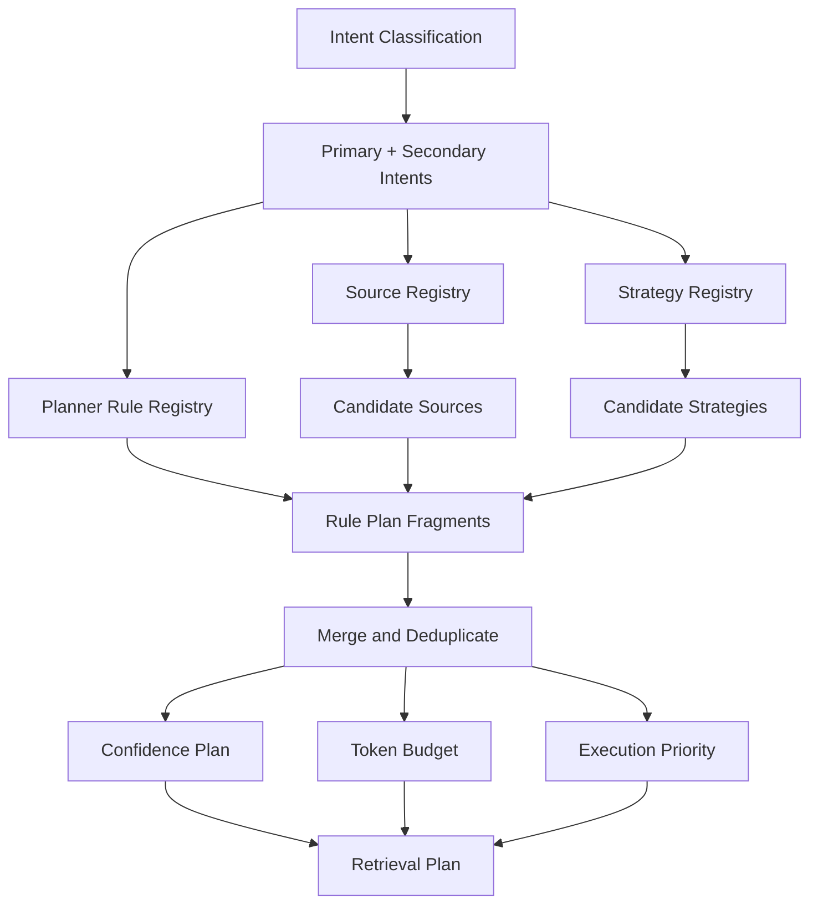

# Retrieval Plan Generation

## Merge Rules

- Sources are deduplicated by name.
- The lowest numeric priority wins.
- Stable priority ordering preserves rule-specific source order for ties.
- Strategies are deduplicated by name and sorted by priority.
- Required confidence is the maximum required by matched rules and selected sources.
- Estimated context tokens are capped at the maximum planner budget.
- Unknown questions produce an insufficient evidence plan.

