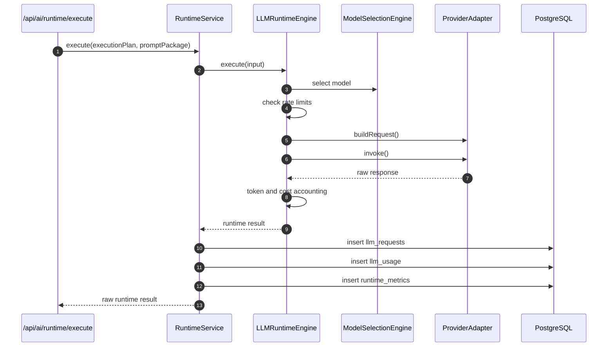

# Runtime Execution

```mermaid
sequenceDiagram
  autonumber
  participant API as /api/ai/runtime/execute
  participant Service as RuntimeService
  participant Runtime as LLMRuntimeEngine
  participant Selector as ModelSelectionEngine
  participant Provider as ProviderAdapter
  participant DB as PostgreSQL

  API->>Service: execute(executionPlan, promptPackage)
  Service->>Runtime: execute(input)
  Runtime->>Selector: select model
  Runtime->>Runtime: check rate limits
  Runtime->>Provider: buildRequest()
  Runtime->>Provider: invoke()
  Provider-->>Runtime: raw response
  Runtime->>Runtime: token and cost accounting
  Runtime-->>Service: runtime result
  Service->>DB: insert llm_requests
  Service->>DB: insert llm_usage
  Service->>DB: insert runtime_metrics
  Service-->>API: raw runtime result
```

Response validation and grounding verification are future phases.

