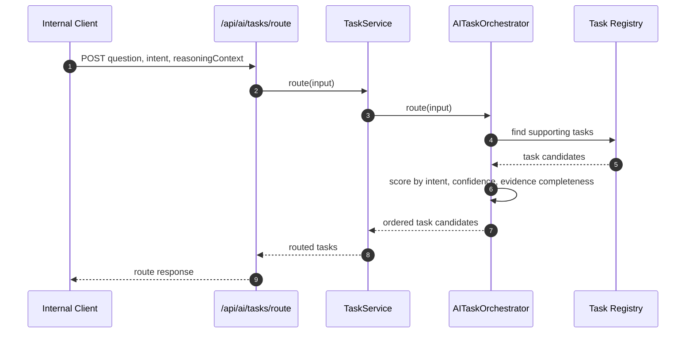

# Task Routing

```mermaid
sequenceDiagram
  autonumber
  participant Client as Internal Client
  participant API as /api/ai/tasks/route
  participant Service as TaskService
  participant Orchestrator as AITaskOrchestrator
  participant Registry as Task Registry

  Client->>API: POST question, intent, reasoningContext
  API->>Service: route(input)
  Service->>Orchestrator: route(input)
  Orchestrator->>Registry: find supporting tasks
  Registry-->>Orchestrator: task candidates
  Orchestrator->>Orchestrator: score by intent, confidence, evidence completeness
  Orchestrator-->>Service: ordered task candidates
  Service-->>API: routed tasks
  API-->>Client: route response
```

No prompt execution or LLM call occurs.

