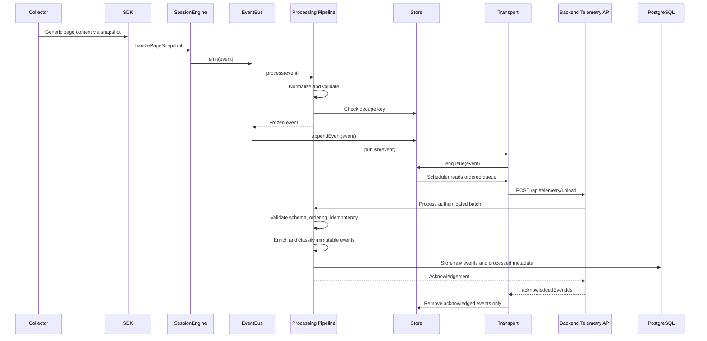

# Telemetry Flow Sequence

The current telemetry flow persists locally and uploads acknowledged batches to the backend.

```mermaid
sequenceDiagram
  participant Collector
  participant SDK
  participant SessionEngine
  participant EventBus
  participant Pipeline
  participant Store
  participant Transport
  participant API as Backend Telemetry API
  participant Pipeline as Processing Pipeline
  participant DB as PostgreSQL

  Collector->>SDK: Generic page context via snapshot
  SDK->>SessionEngine: handlePageSnapshot
  SessionEngine->>EventBus: emit(event)
  EventBus->>Pipeline: process(event)
  Pipeline->>Pipeline: Normalize and validate
  Pipeline->>Store: Check dedupe key
  Pipeline-->>EventBus: Frozen event
  EventBus->>Store: appendEvent(event)
  EventBus->>Transport: publish(event)
  Transport->>Store: enqueue(event)
  Store->>Transport: Scheduler reads ordered queue
  Transport->>API: POST /api/telemetry/upload
  API->>Pipeline: Process authenticated batch
  Pipeline->>Pipeline: Validate schema, ordering, idempotency
  Pipeline->>Pipeline: Enrich and classify immutable events
  Pipeline->>DB: Store raw events and processed metadata
  Pipeline-->>API: Acknowledgement
  API-->>Transport: acknowledgedEventIds
  Transport->>Store: Remove acknowledged events only
```

Collectors remain unaware of upload transport and backend ingestion.
