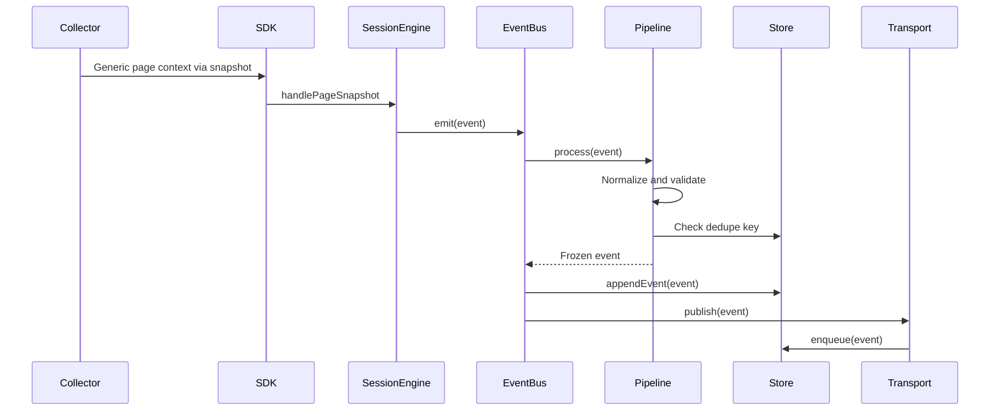

# Telemetry Flow Sequence

The current telemetry flow ends at durable local queueing.

```mermaid
sequenceDiagram
  participant Collector
  participant SDK
  participant SessionEngine
  participant EventBus
  participant Pipeline
  participant Store
  participant Transport

  Collector->>SDK: Generic page context via snapshot
  SDK->>SessionEngine: handlePageSnapshot
  SessionEngine->>EventBus: emit(event)
  EventBus->>Pipeline: process(event)
  Pipeline->>Pipeline: Normalize and validate
  Pipeline->>Store: Check dedupe key
  Pipeline-->>EventBus: Frozen event
  EventBus->>Store: appendEvent(event)
  EventBus->>Transport: publish(event)
  Transport->>Store: enqueue(event)
```

The future backend transport will replace or extend `QueuedTransport` without changing collectors.
