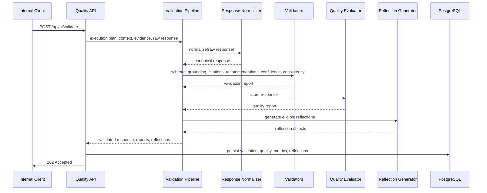

# Validation Pipeline Sequence

```mermaid
sequenceDiagram
  participant Client as Internal Client
  participant API as Quality API
  participant Pipeline as Validation Pipeline
  participant Normalizer as Response Normalizer
  participant Validators as Validators
  participant Quality as Quality Evaluator
  participant Reflection as Reflection Generator
  participant DB as PostgreSQL

  Client->>API: POST /api/ai/validate
  API->>Pipeline: execution plan, context, evidence, raw response
  Pipeline->>Normalizer: normalize(raw response)
  Normalizer-->>Pipeline: canonical response
  Pipeline->>Validators: schema, grounding, citations, recommendations, confidence, consistency
  Validators-->>Pipeline: validation report
  Pipeline->>Quality: score response
  Quality-->>Pipeline: quality report
  Pipeline->>Reflection: generate eligible reflections
  Reflection-->>Pipeline: reflection objects
  Pipeline-->>API: validated response, reports, reflections
  API->>DB: persist validation, quality, metrics, reflections
  API-->>Client: 202 Accepted
```
